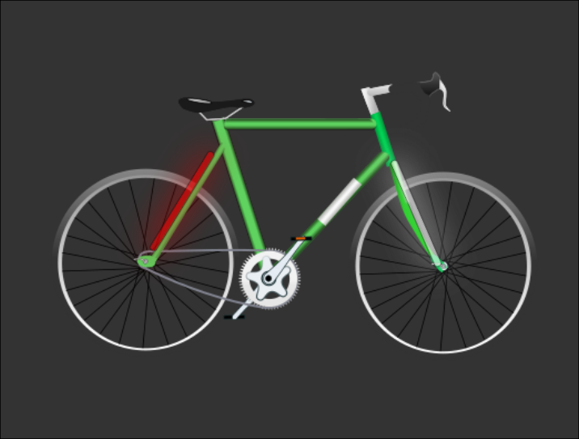

 

  

  <h3 align="center">Super duper bike lights with brake and indicators</h3>

  

    Light up your cycling life!!
     
     
    <a href="https://github.com/doctorbunhead/BikeLights"><strong>Explore the docs »</strong></a>
     
     
    <a href="https://github.com/doctorbunhead/BikeLights">View Demo</a>
    .
    <a href="https://github.com/doctorbunhead/BikeLights/issues">Report Bug</a>
    .
    <a href="https://github.com/doctorbunhead/BikeLights/issues">Request Feature</a>
  

     

## Table Of Contents

* [About the Project](#about-the-project)
* [Built With](#built-with)
* [Getting Started](#getting-started)
  * [Prerequisites](#prerequisites)
  * [Installation](#installation)
* [Usage](#usage)
* [Roadmap](#roadmap)
* [Contributing](#contributing)
* [License](#license)
* [Authors](#authors)

## About The Project

UPDATE - All moved over to EasyEda and fully bench tested OK. NOTE Code is adapted for v1.0 pcb for prototype testing. Change the v1.0 v1.2 commented sections to use v1.2 pbc design. I will soon be moving this project over to ESP32. This will give improved compute power, lower component count and better comms.

This project is currently in a state of flux and I have just moved it from my PC to github. Drawings are now complete. All on EasyEda, no longer Kicad. It's just easier to find parts on there.

These lights are connected via HC12 433MHz radio from front to rear for the indocator functions.

For now i have included some obselete code from when I was playing around with different modules and separate LED drivers.

I will add in the app inventor export too so you have the bluetooth configuration android app to configure this thing when out on the road and find the best settings.

DO NOT ASSUME THIS WILL WORK!! USE AT YOUR OWN RISK. THIS IS AN INCOMPLETE PROJECT WITH ERRORS AND HAS NOT BEEN FULLY TESTED OR DEBUGGED. YOU HAVE BEEN WARNED!!!

Other than the above, feel free to clone, fork, steal, do what the hell you want with this. That's the whole idea of the Arduino community. Marked as GPL license to reflect this.

I hope to add some pretty pictures and stuff to this readme in the not too distant future :)

## Built With

This project uses Arduino. Is coded using Visual Micro extension for Visual Studio 2019

## Getting Started

You don't need Visual Micro for this but I find it very useful.
You will need some Arduino libraries to get going. See the prerequisites.

### Prerequisites

You will need the MPU6050 and i2cdev library from https://github.com/jrowberg/i2cdevlib

You will also need the Adafruit Neopixel libraries. You can install this from the Arduino IDE/Visual Micro

You will also need AltSoftSerial

### Installation

To compile the rear module code, the board must be a Sparkfun Pro Micro ATMEGA32U4 5V type

Front Module is Pro Mini ATMEGA328P 5V/16MHz

## Usage

So what does it do?

The idea is 2 separately powered modules, front and rear, connected by RF or wire. These modules connect to 30cm strips of neopixel LED lighting to be placed on the front forks and rear chainstays of the bike. There will be indicator buttons on the handlebars somewhere which will give Audi style animated indicators. I may hijack some shimano gear to do this. The rear module also contains an MPU6050 accelerometer to provide gravity corrected brake light functionality measured along the Z-axis.

The end game is to have 2 neat and tidy 3D printed boxes that fit on the bike and look good. Everything will be on waterproof plugs and power will come from readily available 4x18650 power packs that come with many bike lights manufactured in China. I always use EFest batteries BTW. They just work and no fake capacity on the labelling. They hold up well in cold conditions too.

Please please please don't bombard me with too many issues/problems/questions at this time as I know this is very rough around the edges right now but please do make any contribution you can.

Structure EasyEda Projects - The actual schematics and PCB layouts for everything (WARNING - could be wrong!!) src - All source code for everything

For the source I use Visual Micro so i can develop Arduino inside Visual Studio. I really like it but you can work directly on the .ino files in arduino IDE instead.

There might be some missing Arduino libraries. Just shout and I will add them to the source.

Have fun. I've hopefully done most of the hard work.

## Roadmap

See the [open issues](https://github.com/doctorbunhead/BikeLights/issues) for a list of proposed features (and known issues).

## Contributing

Contributions are what make the open source community such an amazing place to be learn, inspire, and create. Any contributions you make are **greatly appreciated**.
* If you have suggestions for adding or removing projects, feel free to [open an issue](https://github.com/doctorbunhead/BikeLights/issues/new) to discuss it, or directly create a pull request after you edit the *README.md* file with necessary changes.
* Please make sure you check your spelling and grammar.
* Create individual PR for each suggestion.
* Please also read through the [Code Of Conduct](https://github.com/doctorbunhead/BikeLights/blob/main/CODE_OF_CONDUCT.md) before posting your first idea as well.

### Creating A Pull Request

1. Fork the Project
2. Create your Feature Branch (`git checkout -b feature/AmazingFeature`)
3. Commit your Changes (`git commit -m 'Add some AmazingFeature'`)
4. Push to the Branch (`git push origin feature/AmazingFeature`)
5. Open a Pull Request

Please contribute in any way you can. What I really need to finalise are the schematics. The modules need 5v to 3v3 components adding. 5V comes from a module. I also need to decide on connectors, probably automotive ones, and then create a 3D box design. I have never done this and don't even own a 3D printer currently.

## License

Distributed under the GNU General Public License v3.0. See [LICENSE](https://github.com/doctorbunhead/BikeLights/blob/main/LICENSE.md) for more information.

## Authors

* **Kristian Dunn** - *Software Developer* - [Kristian Dunn](https://github.com/doctorbunhead/) - **

